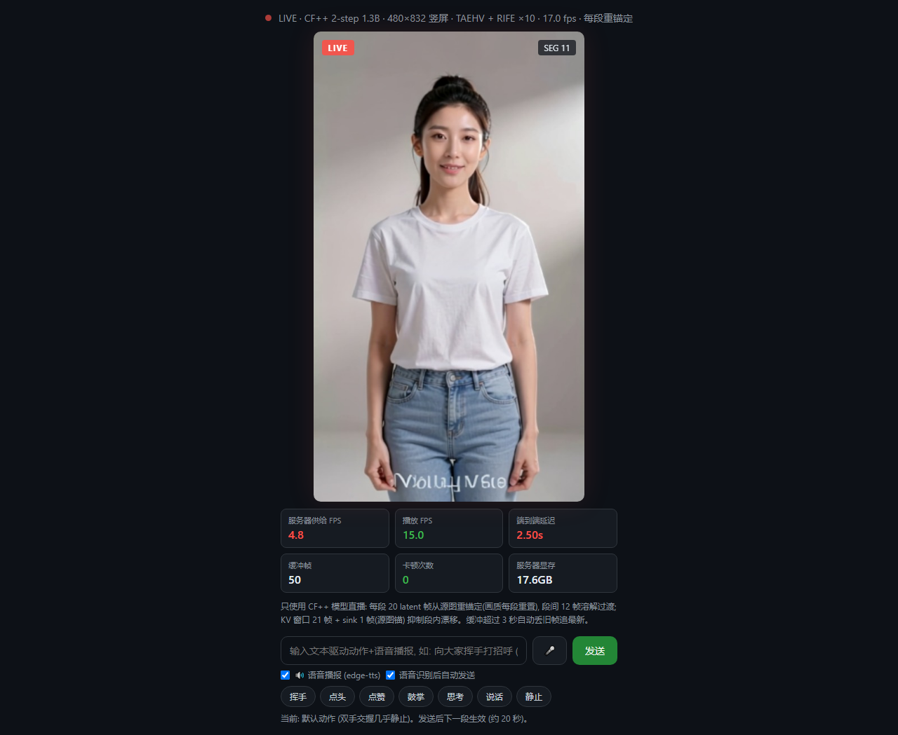

# CF++ 实时数字人直播服务

基于 **Causal Forcing++ (CF++)** 帧级自回归视频生成模型的实时数字人直播系统：
一张源图驱动，文本/动作词控制，浏览器实时观看，支持语音播报与实时口型同步。



## 主要功能

| 功能 | 说明 |
|---|---|
| **实时视频生成** | CF++ 1.3B 蒸馏模型（2-step），480×832 竖屏，每段 20 latent 块从源图重锚定，段间 12 帧 crossfade 溶解过渡 |
| **直播流播放** | Flask + SSE/JPEG 流，浏览器打开即看；页面实时显示 供给FPS / 播放FPS / 端到端延迟 / 丢帧 / 卡顿 / 显存 |
| **RIFE 插帧** | 源帧 ~5fps → 播放 15-17fps（静默段 ×10，说话段自动降档 ×6 为口型让出算力） |
| **实时口型同步** | MuseTalk V15（fp16 + torch.compile + 解码裁剪 5.8-6.8fps），音频驱动嘴部重绘，椭圆羽化贴回 + 低频色偏校准 |
| **TTS 语音播报** | edge-tts 在线合成（CPU，零 GPU 争抢），文本发送后自动播报，mp3 结果缓存 |
| **文本驱动动作** | 输入"招手/点头/点赞/鼓掌/思考…"自动映射为动作提示词，下一段（约 20s）生效 |
| **画质保护** | KV 滚动窗口 21 帧 + sink 锚帧抑制漂移；段间从源图干净重锚定，延迟超 3s 自动切旧帧保实时 |

## 架构与数据流

```
源图 portrait.png
   │
   ▼
CF++ framewise 2-step (3090/cuda:0, ~0.75s/块, 每块 +4 源帧)
   │
   ▼  gen_q
MuseTalk 口型重绘 (3090/cuda:0, 5.8-6.8fps, 说话段生效, 静默段直通)
   │
   ▼  gen_q2
RIFE 4.7 批量插帧 (3050/cuda:1, 静默 ×10 / 说话 ×6)
   │
   ▼  out_q (drop-oldest)
JPEG 流 (SSE) → 浏览器播放 (目标 17fps 自适应节拍)
                └ edge-tts (CPU) → <audio> 同步播报
```

## 快速开始

### 1. 环境与依赖安装

#### 1.1 创建 Python 虚拟环境

实测环境为 **Python 3.10**（3.11+ 未验证），推荐 conda 或 venv 二选一：

```bash
# conda
conda create -n cfpp python=3.10 -y
conda activate cfpp

# 或 venv
python -m venv cfpp_env
cfpp_env\Scripts\activate        # Windows
source cfpp_env/bin/activate     # Linux
```

#### 1.2 安装 PyTorch（按本机 CUDA 版本选择）

```bash
# CUDA 12.4 (实测组合)
pip install torch==2.6.0 torchvision --index-url https://download.pytorch.org/whl/cu124

# CUDA 12.8
pip install torch torchvision --index-url https://download.pytorch.org/whl/cu128

# 仅 CPU (仅调试代码逻辑, 无法实时直播)
pip install torch torchvision
```

#### 1.3 安装 Python 依赖

```bash
pip install -r requirements.txt
```

#### 1.4 安装系统依赖 ffmpeg（必需）

口型音频解码（mp3→16k PCM）与 TTS 产物处理调用 **ffmpeg 命令行**，必须加入 PATH：

```bash
# Windows
winget install Gyan.FFmpeg
# 或从 https://www.gyan.dev/ffmpeg/builds/ 下载, 解压后把 bin 目录加入 PATH

# Linux
sudo apt install ffmpeg

# 验证
ffmpeg -version
```

#### 1.5 实测可用版本组合（参考）

| 包 | 实测版本 | 备注 |
|---|---|---|
| Python | 3.10.21 | |
| torch | 2.6.0+cu124 | CUDA 12.4 |
| diffusers | 0.31.0 | **必须固定**，UNet2DConditionModel 结构依赖此版 |
| transformers | 5.16.1 | WhisperModel / WhisperFeatureExtractor |
| opencv-python | 4.11.0.86 | |
| numpy | 1.24.4 | 建议固定（2.x 有 API 不兼容风险） |
| av | 13.1.0 | 固定 |
| edge-tts | 7.2.8 | TTS 语音播报 |
| flask | 3.1.3 | Web 服务 |
| ffmpeg | 系统级 | 音频解码 |

#### 1.6 验证安装

```bash
python -c "import torch; print(torch.cuda.is_available(), torch.cuda.get_device_name(0))"
# 期望输出: True NVIDIA GeForce RTX 3090 ...
```

### 2. 模型权重放置（代码内为绝对路径，需按此放置或修改 live_server.py 顶部常量）

| 权重 | 放置路径 | 说明 |
|---|---|---|
| CF++ checkpoint | `..\cfpp_git\causal-forcing++\framewise-2step.pt` | `--ckpt` 可覆盖 |
| Wan 底模 + config | `..\wan_models\` | 约 16.7GB |
| TAEHV 解码器 | `checkpoints\taew2_1.pth` | 已包含（21.6MB） |
| MuseTalk V15 / sd-vae-ft-mse / whisper-tiny | `..\..\musetalk_models\` | 见 lipsync_musetalk.py 的 `MT_MODELS` |
| RIFE 4.7 | `F:\...\rife_arch.py` + `rife47.pth` | live_server.py 的 `RIFE_ARCH` / `RIFE_CKPT` |
| 源图 | `D:\...\i2v_std\15-26\portrait.png` | live_server.py 的 `IMG_PATH`，480×832 竖屏人像 |

### 3. 启动

```bash
python live_server.py --lipsync
```

浏览器打开 `http://127.0.0.1:8390`，在输入框发文本即可驱动动作 + 语音播报 + 口型同步。

## 常用参数

| 参数 | 默认 | 说明 |
|---|---|---|
| `--lipsync` | 关 | 启用 MuseTalk 实时口型 |
| `--lipsync_gpu` | 0 | 口型所在 GPU（默认与 CF++ 同 3090；与 RIFE 解耦是口型提速关键） |
| `--lipsync_mult` | 6 | 说话段 RIFE 插帧倍数 |
| `--mult` | 10 | 静默段 RIFE 插帧倍数 |
| `--target_fps` | 17 | 前端播放节拍 |
| `--height/--width` | 832/480 | 生成分辨率（8 的倍数） |
| `--blocks` | 20 | 每段 latent 块数 |
| `--fade` | 12 | 段间 crossfade 帧数 |
| `--reanchor` | source | source=每段从源图重锚定 / hot=自回归传递 |
| `--caption` | 内置 | 覆盖默认提示词（手部描述越简单越不易变形） |
| `--cudagraphs` | 关 | DiT 前向图捕获，denoise 0.75s→~0.2s，供给翻倍 |

## HTTP API

| 接口 | 方法 | 说明 |
|---|---|---|
| `/` | GET | 直播页面 |
| `/video.mp4` | GET | MJPEG/SSE 视频流 |
| `/caption_speak` | POST `{"text": "..."}` | 文本 → 动作提示词 + TTS 播报 + 口型 |
| `/speak` | POST | 仅 TTS 播报 + 口型 |
| `/stats` | GET | 运行统计 JSON |

## 实测性能（3090 + 3050 双卡）

| 指标 | 数值 |
|---|---|
| CF++ 供给 | ~5.3 源帧/s（denoise 0.75s/块 + TAEHV 90ms） |
| MuseTalk 口型 | 服务内 5.8-6.8fps（>5.3 供给即无积压；同卡争抢时仅 3.3fps） |
| 播放帧率 | 15-17fps（RIFE 插帧后） |
| 显存 | 3090 约 17.6GB（CF++ + TAEHV + MuseTalk） |

## 目录结构

```
├── live_server.py        # 直播服务主程序 (生成/插帧/口型/TTS/播放 四线程)
├── lipsync_musetalk.py   # MuseTalk 口型核心 (编译加速/解码裁剪/椭圆贴回/色偏校准)
├── stream_pipeline.py    # 流式管线 (备用)
├── inference.py          # CF++ 离线推理脚本
├── pipeline/             # CausalForcing 管线实现
├── wan/                  # Wan 模型结构定义
├── demo_utils/           # TAEHV 解码器 / 显存管理
├── utils/                # 通用工具
├── configs/              # 模型与推理配置 yaml
├── checkpoints/          # TAEHV 权重 (taew2_1.pth)
├── prompts/              # 提示词素材
├── assets/               # 示例资源
├── docs/                 # 截图等文档资源
├── _bench_*.py           # 性能基准工具 (分段计时/优化对比)
├── _diag_color.py        # 口型贴回色差诊断工具
└── _download_*.py        # 模型下载辅助脚本
```

## 已知调优结论（实测）

- **口型 FPS 与 GPU 布局**：MuseTalk 与 RIFE 同卡时因 GPU 串行争抢仅 3.3fps（<5.3 供给会积压丢帧、口型滞后）；分卡后 6.8fps
- **贴回色差**：椭圆参数必须换算到 256 工作空间（裁剪区≠256px 时坐标系 bug 会让椭圆罩住鼻区），上缘避开 UNet 遮罩重绘偏差区，低通差限幅校准消除 VAE 色偏
- **KV 窗口**：`local_attn_size=21 + sink=1` 非侵入注入，抑制段内漂移
- **通道格式**：VAE 用 channels_last 反而变慢（72.6→93ms），保持默认布局
